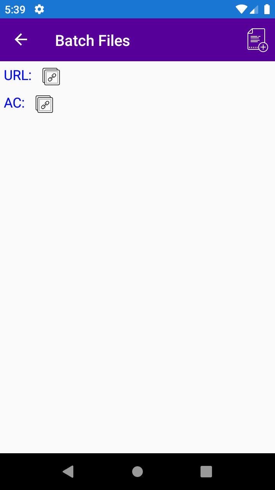

# GoFileClient
Mobile client with https://gofile.io/api 

You can upload files to popular GoFile site from mobile and share the URL to anyone to download, can share Admin Code(AC) to delete them if needed.

Credits:  
API: https://gofile.io/api  
Icons: https://icons8.com/  
Logo: https://hatchful.shopify.com/

## Coming Soon!

* Delete Files in server or local or both
* Status of file upload
* Add URL and download files, control same if Admin code available

# Screenshots

